# 2023-Asia-Pacific-Mathematical-Contest-in-Modeling
**Our paper:** [APMCM-paper.pdf](https://github.com/unicorn-yh/2023-Asia-Pacific-Mathematical-Contest-in-Modeling/blob/main/APMCM-paper.pdf)

**Problem A Selected:**  [2023 APMCM Problem A.pdf](https://github.com/unicorn-yh/2023-Asia-Pacific-Mathematical-Contest-in-Modeling/blob/main/Problem-Analysis/2023-APMCM-Problem-A.pdf)

**Topic:** Problem A - Image Recognition of Fruit Picking Robots

 

### **Index:**

1. [Overview](https://github.com/unicorn-yh/2023-Asia-Pacific-Mathematical-Contest-in-Modeling/tree/main#overview)
2. [Q1: Counting apples](https://github.com/unicorn-yh/2023-Asia-Pacific-Mathematical-Contest-in-Modeling/tree/main#question-1-counting-apples)
3. [Q2: Estimating the positions of apples](https://github.com/unicorn-yh/2023-Asia-Pacific-Mathematical-Contest-in-Modeling/tree/main#question-2-estimating-the-positions-of-apples)
4. [Q3: Estimating the maturity state of apples](https://github.com/unicorn-yh/2023-Asia-Pacific-Mathematical-Contest-in-Modeling/tree/main#question-3-estimating-the-maturity-of-apples)
5. [Q4: Estimating the masses of apples](https://github.com/unicorn-yh/2023-Asia-Pacific-Mathematical-Contest-in-Modeling/tree/main#question-4-estimating-the-masses-of-apples)
6. [Q5: The recognition of apples](https://github.com/unicorn-yh/2023-Asia-Pacific-Mathematical-Contest-in-Modeling/tree/main#question-5-the-recognition-of-apples)

 

## Overview

#### **1. Main task**

- Question 1: Counting apples <u>*[Image recognition]*</u>

- Question 2: Estimating the positions of apples <u>*[Image Segmentation + Object Localization]*</u>

- Question 3: Estimating the maturity state of apples *<u>[Feature Extraction]</u>*

- Question 4: Estimating the masses of apples <u>*[Object Area Calculation]*</u>

- Question 5: The recognition of apples <u>*[Image Classification]*</u>

#### **2. Dataset**

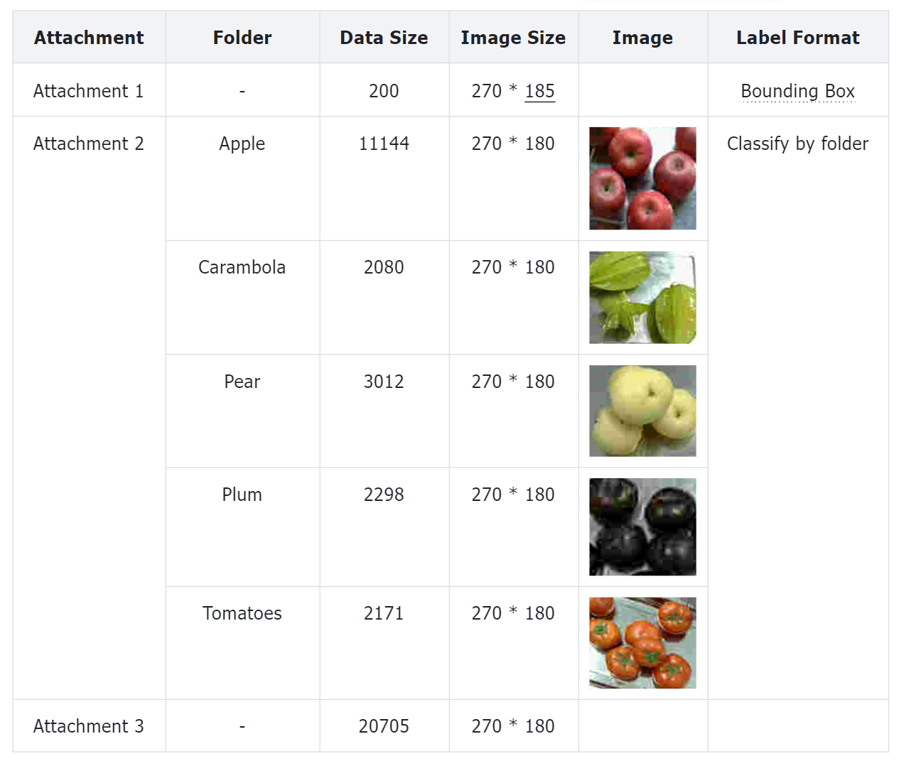

 

## Question 1: Counting apples

*Data used: Attachment 1*

We have designed the **Tri-Harmonize Augmentation** and **Contours Detection** to identify the count of apples. This method ensures precise apple counting by generating circles around each identified fruit, leading to an approximate of 28,073 apples detected throughout the dataset.

1. ***Tri-Harmonize Augmentation.*** We design to augment the dataset by creating new images that combine different types of noise and sharpness. This can be beneficial in training robust machine learning models, especially in image processing tasks. We blends three different versions of an image (unsharp masked, with Gaussian noise, and with salt-and-pepper noise) to create an the augmented images.

2. ***Setup and Color Range Definition.*** We define color ranges in the HSV (Hue, Saturation, Value) color space for different states of apples (ripe red, raw red, ripe yellow, raw yellow, ripe green, raw green). These color ranges are used to create masks that filter out apples based on their color and maturity state. 

3. ***Create Masks for Apple Detection.*** For each predefined apple color range, a binary mask is created. This mask highlights areas of the image that fall within the specified color range. All individual masks are combined into a single mask that represents all apples regardless of their color or maturity.

4. ***Find and Draw Contours.*** The algorithm uses combined mask to detect contours, which are essentially boundaries of apples.For each contour, we find the smallest circle that can enclose the contour, which represents an apple.If the radius of this circle is above a certain threshold (0.5 for original images, 1 for augmented images), it is counted as an apple, and the circle is drawn on the image.

5. ***Count Apples.*** The number of apples detected in each image is counted. For each apple detected in the augmented images, a dictionary with label, center point, and radius is created and added to a list.

   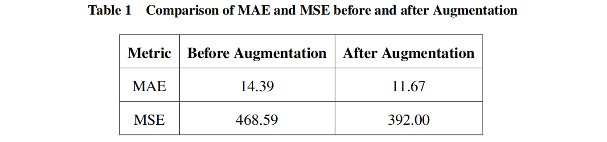

   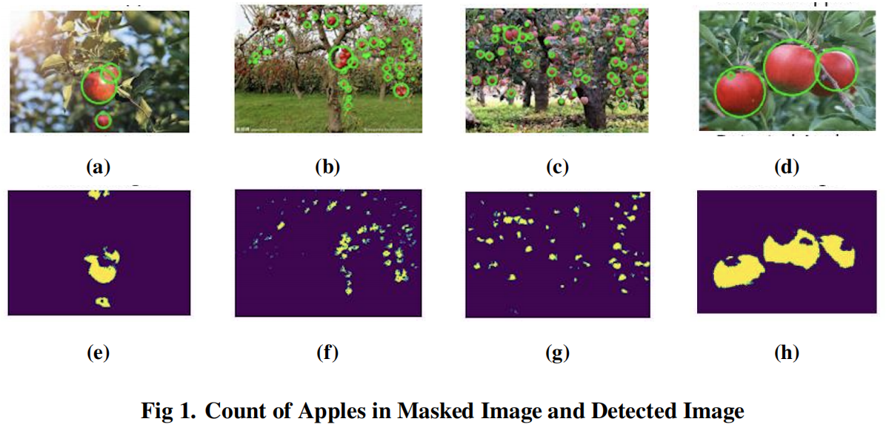

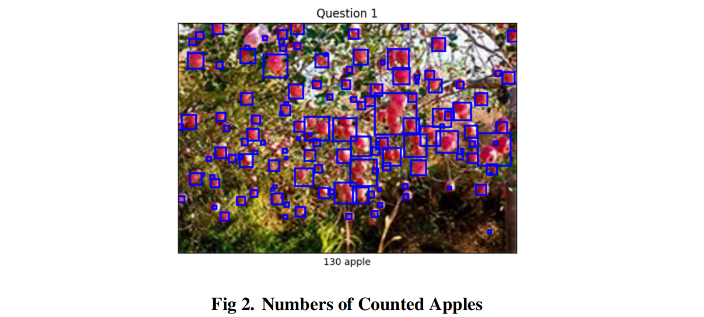

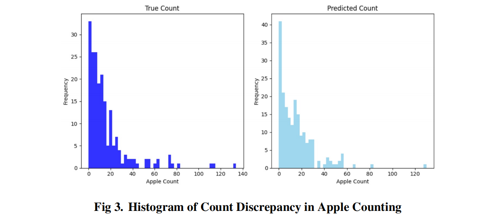

 

## Question 2: Estimating the positions of apples

*Data used: Attachment 1*

**Image segmentation** techniques will isolate the apples from the background, and **object localization** methodologies will be applied to pinpoint their exact positions, culminating in a 2D scatter diagram to visually map their spatial distribution.

1. ***Image Filtering using Gaussian Filtering.*** Gaussian noise will be added to the training images which stimulates the potential variations and imperfections that the model might encounter in this paper. Due to statistical properties of Gaussian noise, the model will be trained to become more generalized and be able to perform classification task and robust against minor perturbations.

2. ***Salt and Pepper Noise.*** In image processing, salt and pepper noise is added to enhance image quality by removing noise and enhancing the robustness of algorithms. Firstly, a noise-free original image is required for processing. Then, an appropriate salt and pepper noise density $p$ which will decide the proportion of pixels in the image that will be affected by noise should be determined. Then, each pixel $I(x,y)$ in the original image will be generated a random number r between 0 and 1 . 

   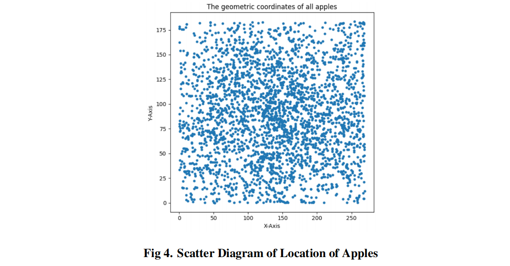

 

## Question 3: Estimating the maturity of apples

*Data used: Attachment 1*

**Bicubic interpolation** for image scaling and **GrabCut** for precise background removal are being utilized. **Feature extraction** is conducted via KMeans clustering, analyzing RGB values within central circular segments. The classification of apple maturity is then visualized in a histogram, effectively demonstrating the method's capability in discerning ripeness levels from image data.

1. ***Image Segmentation using GrabCut.*** The GrabCut algorithm utilizes a Gaussian Mixture Model (GMM) to effectively handle the color information across the three RGB channels. Segmentation estimation and model parameter learning are performed concurrently which ensures that the model adapts to the input data

2. ***Iterative Energy Minimization Segmentation Algorithm.*** 

   - **Gaussian Component:** Assign each pixel to a Gaussian component in the GMM (for example, if pixel n is an object pixel, then substitute pixel n's RGB value into each Gaussian component of the object GMM, and the one with the highest probability is most likely to generate n, i.e., the $k_n-th$ Gaussian component of pixel n).

   - **GMM Classification:** Optimize the GMM parameters for the given image data Z since in step (1) we have already classified each pixel to a Gaussian component, each Gaussian model now has a set of pixel samples. The mean and covariance of its parameters can be estimated from these pixel samples' RGB values, and the weight of each Gaussian component can be determined by the ratio of the number of pixels belonging to that component to the total number of pixels.

   - **Graph Cut Classification:** Segmentation estimation (construct a graph using the Gibbs energy terms analyzed in step (1) , establish the weights of t-links and n-links, and then segment using the max flow/min cut algorithm).

   - **Final Convergence Classification:** Repeat step (1) to (3) until convergence. After the segmentation in step (3) , each pixel's belonging to either the object GMM or the background GMM changes, so each pixel's $k_n$ changes, and therefore the GMM changes too. Thus, each iteration interactively optimizes both the GMM model and the segmentation result. Moreover, since steps (1) to (3) are all processes of energy reduction, it ensures that the iterative process will converge.

     *Flowchart illustrated is as below:* 

     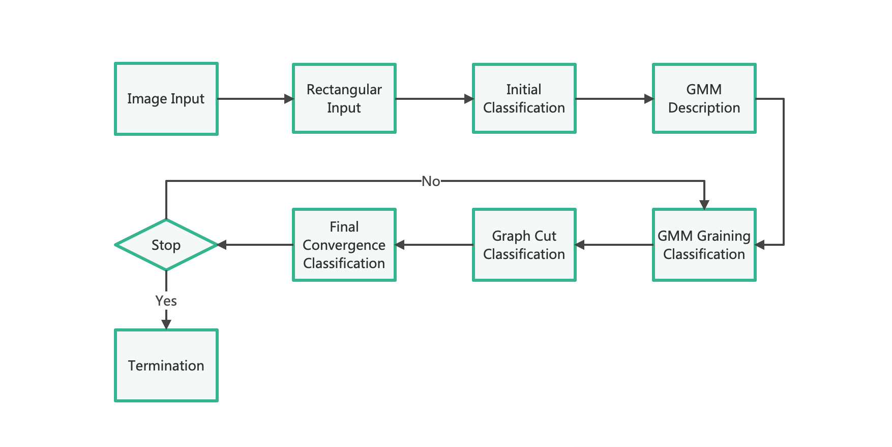

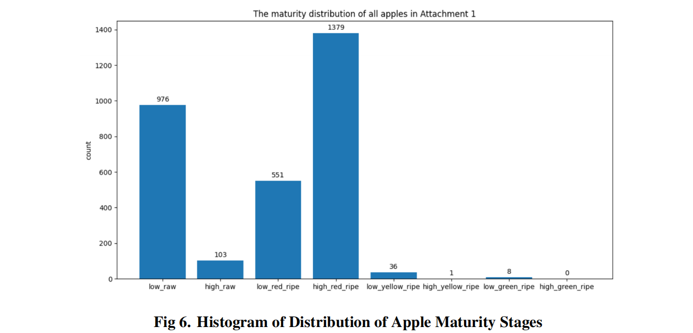

 

## Question 4: Estimating the masses of apples

*Data used: Attachment 1*

We manipulate the RGB values of pixels in each image to calculate the **two-dimensional area** of the apples. This area is then adjusted according to the image's scaling ratio and multiplied by a density factor of 0.7 to estimate mass.

Firstly, we begin the foundation of mass estimation by accurately determining the area occupied by each apple in the image. This process starts with ***isolating the apple from the background***, a task we achieve through the GrabCut algorithm, renowned for its effectiveness in segmenting objects in images. Following this segmentation, we employ the ***K-Means clustering algorithm***, focusing on color classification to distinguish between different ripeness levels of the apples. This step is crucial as it directly impacts the subsequent area calculation. We initially compute the area in the standardized 100x100 pixel space and then scale it up proportionally to match the original image dimensions. This scaling is vital to ensure accuracy, as the resized image dimensions are adopted primarily for processing convenience.

The core innovation of our method is the conversion of the calculated area into an estimated mass. This is done using a ***predetermined conversion factor***, which in our case is 0.7. This factor is presumably derived from empirical data or established correlations between the visible area of an apple in an image and its actual mass. The choice of this factor is critical as it directly influences the accuracy of the mass estimation. It's a reflection of the density and physical properties of the apple, tailored to the specific varieties and conditions under study.
$$
\begin{equation}
Estimated\ Mass = Area \times Conversion\ Factor
\end{equation}
$$
where, Conversion Factor = Pre-determined factor for converting area to mass (0.7 in this case)

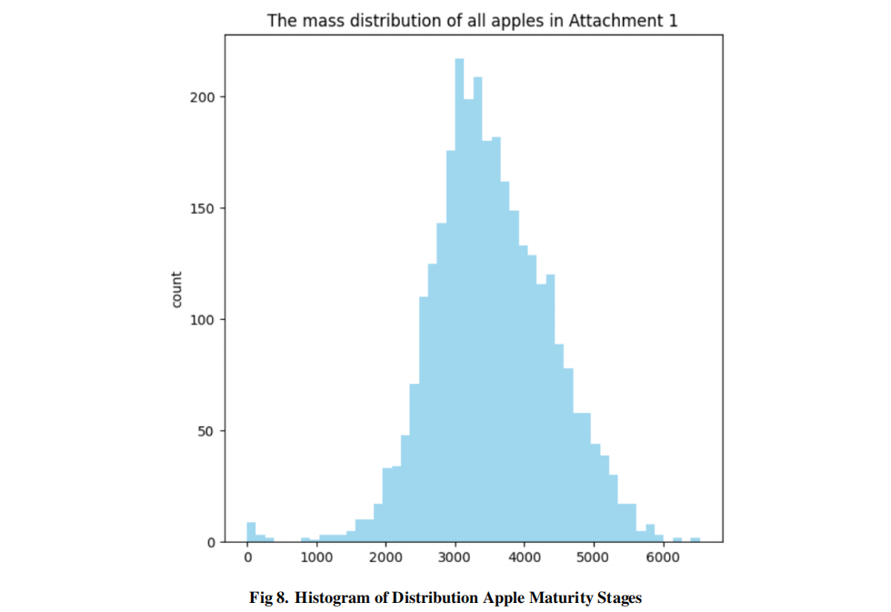

 

## Question 5: The recognition of apples 

*Data used: Attachment 2 & 3*

**Convolutional Neural Network (CNN)** is trained using a designated dataset for the task of apple recognition. This model is then applied to a separate set of images for identifying apples. Following this, a histogram is generated to visually depict the frequency of 11,241 identified apples, effectively illustrating their distribution within the dataset.

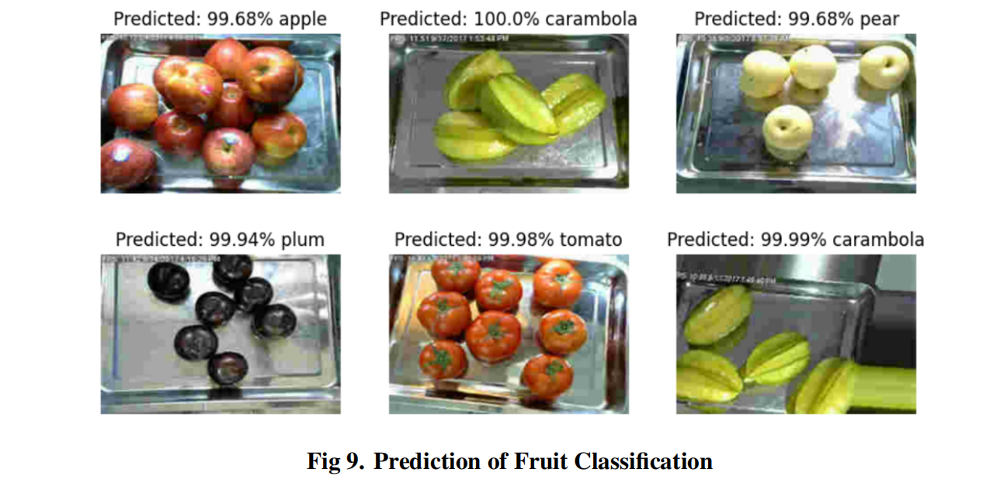

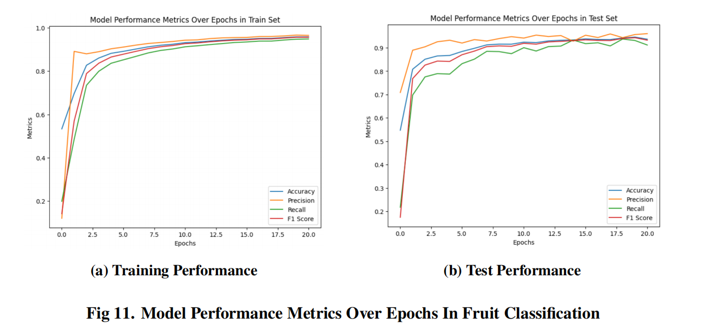

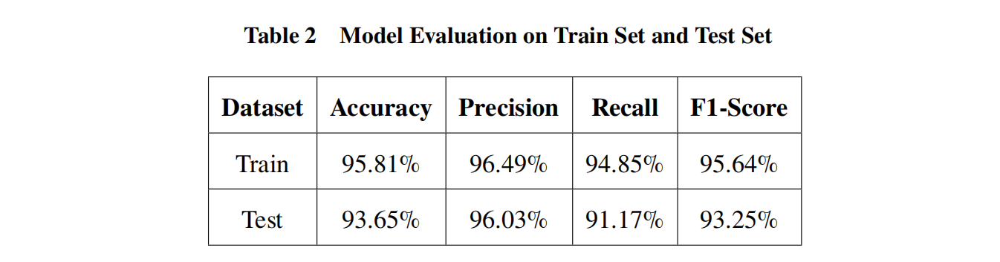
